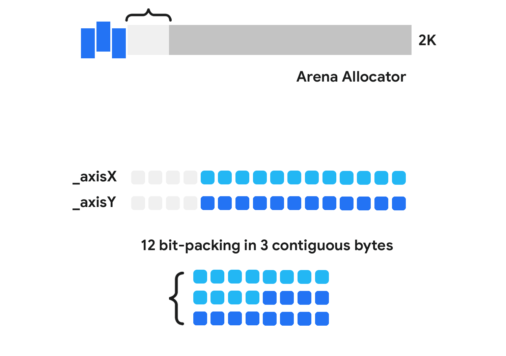
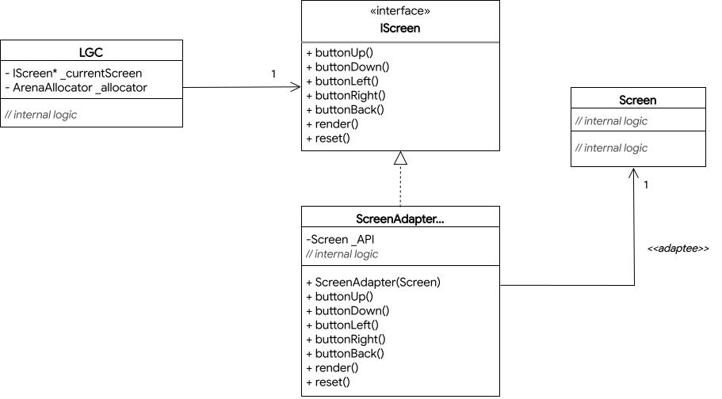

An experiment to boost the performance of a simulated console by taking advantage of modern C++ features. The goal is to combine Object Oriented Design Patterns with minimal resource use, resulting in an optimized runtime. Additionally, a custom arena allocator is implemented to minimize memory and eliminate heap fragmentation. It also simulates a 12 bit-packing for joysticks into 3 contiguous bytes.

  
  

